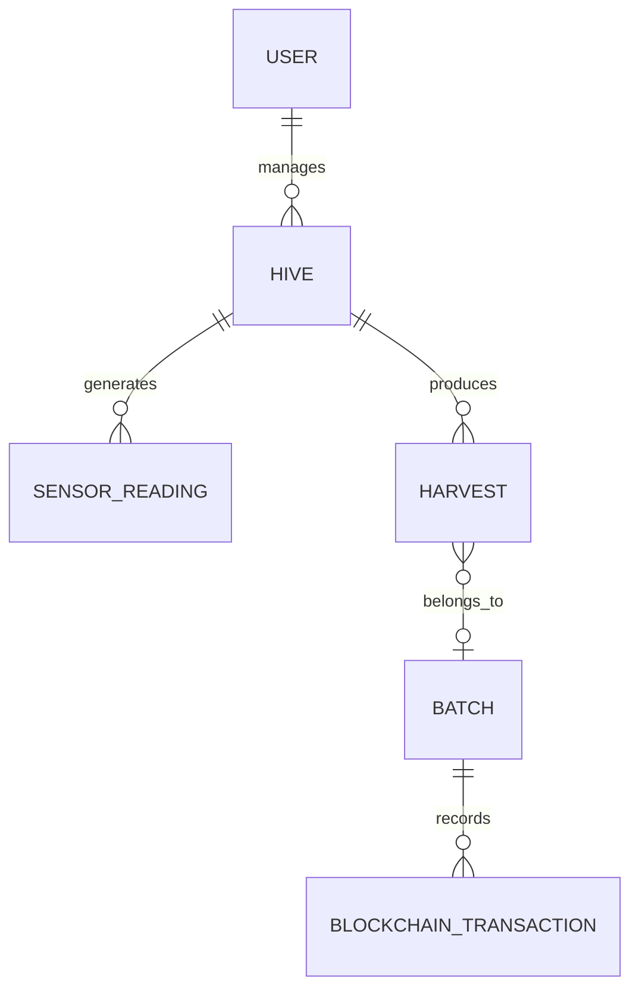

# 🍯 HoneyChain / ApiVera

### IoT + AI/ML + Blockchain powered honey traceability and hive intelligence platform

## 1. Overview
HoneyChain (ApiVera) is a comprehensive platform designed to provide traceability, monitoring, and analytics for beekeeping operations. It leverages simulated IoT telemetry, machine learning, and blockchain technology to ensure the authenticity of honey batches while providing actionable insights to beekeepers regarding hive health. 

By integrating sensor data with an anomaly detection engine and immutably recording harvest and batch custody transfers on the blockchain, HoneyChain bridges the gap between precision agriculture and verifiable supply chains.

## 2. Key Features

### 🐝 Hive Monitoring
* Real-time telemetry ingestion (Temperature, Humidity, Weight, Sound Level)
* Synthetic data generation (Replay Mode) for demonstration and testing

### 🤖 AI/ML (Partially Implemented)
* Anomaly detection using `scikit-learn`'s Isolation Forest
* Hybrid risk scoring based on temperature, humidity, and weight deviations

### ⛓️ Blockchain
* Immutable record of hives, harvests, and batches
* Custody tracking and batch merging functionality
* Smart contract deployed/deployable on Polygon Amoy Testnet

### 📱 Mobile Application
* Built with React Native and Expo
* 3D visualizations using `react-three-fiber` and `@react-three/drei`
* Role-based interfaces and scanning capabilities

### 📷 QR Verification
* Scannable product QR generation for consumers
* Verification of product authenticity against blockchain records

## 3. System Architecture

```mermaid
flowchart TD
    B[Synthetic Data Generator] -->|MQTT| C[MQTT Broker]
    C --> D[FastAPI Backend]

    D --> E[(Relational DB)]
    D --> F[AI/ML Engine (Isolation Forest)]
    D --> G[Blockchain Service (web3.py)]

    G --> H[Polygon Amoy / Local Node]
    H --> I[Solidity Smart Contract]

    D --> J[REST API]

    J --> L[React Native Mobile App]

    M[Consumer] --> N[QR Code]
    N --> O[Verification Endpoint]
    O --> D
```

*(Note: Physical IoT sensors and ESP32 firmware are planned but currently simulated using the backend's Replay Mode).*

## 4. How the Subsystems Communicate
* **Simulator → MQTT Broker:** The Python backend runs a background thread that publishes synthetic JSON telemetry to MQTT topics.
* **MQTT Broker → Backend:** FastAPI runs an MQTT worker that subscribes to telemetry topics and ingests messages into the database.
* **Backend → Database:** SQLAlchemy handles relational reads/writes (SQLite/PostgreSQL).
* **Backend → AI/ML:** A Python ML engine processes incoming telemetry to calculate hybrid risk scores.
* **Backend → Blockchain:** `web3.py` signs and submits smart-contract transactions on behalf of the system to record harvests and batches.
* **Backend → Apps:** REST APIs provide standard data access for the mobile application.
* **Consumer → QR → Backend:** QR scanning resolves to a public verification endpoint to trace batch history.

## 5. Technology Stack

| Layer             | Technology            | Purpose                   |
| ----------------- | --------------------- | ------------------------- |
| Mobile Frontend   | React Native (Expo)   | Mobile application        |
| 3D Rendering      | react-three-fiber     | 3D UI elements            |
| Backend           | FastAPI               | REST API                  |
| Database Access   | SQLAlchemy            | Database ORM              |
| Messaging         | MQTT (paho-mqtt)      | IoT communication         |
| ML                | scikit-learn          | Anomaly detection models  |
| ML Models         | joblib                | Model persistence         |
| Blockchain        | Solidity              | Smart contracts           |
| Network           | Polygon Amoy          | Testnet                   |
| Blockchain Client | web3.py               | Contract interaction      |
| Auth              | PyJWT / passlib       | JWT authentication        |

## 6. User Roles

### 👨‍🌾 Beekeeper
Registers hives, monitors telemetry, receives ML insights, and records harvests.

### 🏭 Processor
Manages batches, merges harvests, and records processing and lab testing steps.

### 🛡️ Admin
System administration capabilities.

### 🛒 Consumer
Scans QR codes to verify product authenticity, lab tests, and processing history.

## 7. Data Flow

```text
Synthetic Telemetry
      ↓
MQTT Broker
      ↓
FastAPI (MQTT Worker)
      ↓
SQLAlchemy (Database)
      ↓
AI/ML Analysis
      ↓
Blockchain Record (Harvest/Batch)
      ↓
REST API
      ↓
Mobile App / Dashboard
```

## 8. Database Schema



* **User**: `id`, `username`, `role`, `hashed_password`
* **Hive**: `id`, `owner_id`, `name`, `location`
* **SensorReading**: `id`, `hive_id`, `temperature_c`, `humidity_pct`, `weight_kg`, `sound_level_db`
* **Harvest**: `id`, `hive_id`, `weight_kg`, `batch_id`, `tx_hash`
* **Batch**: `id`, `status`, `is_merged`, `document_hash`
* **BlockchainTransaction**: `id`, `tx_hash`, `action_type`

## 9. API Structure
The backend exposes routers for various domains:
* `POST /auth/register`, `POST /auth/login`
* `/hives/...` - Hive management
* `/harvests/...` - Harvest tracking
* `/batches/...` - Batch processing and custody
* `/verify/...` - Public product verification

## 10. MQTT Topics
* `hivechain/{hive_id}/telemetry`: Used by the backend replay mode to publish simulated sensor data (temperature, humidity, weight, sound level).

## 11. Blockchain integration
* **Contract**: `HoneyChain.sol` (deployed via local node or Polygon Amoy)
* **Client**: Uses `web3.py` in the FastAPI backend to act as a relayer, signing transactions with a configured private key.
* **Functions**: Registers hives, creates harvests/batches, transfers custody, records processing/lab tests, and verifies products.

## 12. AI/ML Engine
* **Implemented**: A hybrid risk calculator that combines raw deviations (temperature, humidity, weight) with an anomaly score from a `scikit-learn` Isolation Forest model.
* **Dummy Data**: Currently, the Isolation Forest model is trained on dynamically generated dummy data at startup to demonstrate functionality.

## 13. Installation & Setup

### Backend
```bash
cd backend
pip install -r requirements.txt
# Ensure MQTT broker is accessible or adjust config
uvicorn main:app --reload
```

### Mobile App (Frontend)
```bash
npm install
npx expo start
```

## 14. Environment Variables
Required environment variables for the backend (`.env`):
```env
# Database
DATABASE_URL=

# MQTT
MQTT_BROKER=
MQTT_PORT=
REPLAY_MODE=True

# Authentication
SECRET_KEY=
ACCESS_TOKEN_EXPIRE_MINUTES=

# Blockchain
WEB3_PROVIDER_URI=
WEB3_PRIVATE_KEY=
CONTRACT_ADDRESS=
```

## 15. Project Structure
```text
ApiVera/
├── app/                  # Expo Router mobile app entry points
├── backend/              # FastAPI application
│   ├── routers/          # API endpoints
│   ├── services/         # ML, Web3, MQTT, and Replay Mode
│   ├── main.py           # App entry point
│   └── models.py         # SQLAlchemy models
├── blockchain/           
│   └── contracts/        # Solidity smart contracts
├── src/                  # React Native source code
│   ├── components/       # UI components
│   ├── features/         # Screen logic
│   └── mock/             # Frontend mock data
├── package.json          # Frontend dependencies
└── README.md             # This file
```

## 16. Roadmap / Planned Features
- [ ] **Firmware**: Implement ESP32/Arduino code for physical sensor integration (currently simulated via backend Replay Mode).
- [ ] **Production ML**: Train the Isolation Forest model on historical real-world hive telemetry instead of dummy data.
- [ ] **Blockchain Deployment**: Fully configure Hardhat deployment scripts and tests.

## 17. Security Notes
* **API Protection**: Endpoints are secured using PyJWT.
* **Blockchain Wallets**: The backend acts as a custodial relayer. The `WEB3_PRIVATE_KEY` must be heavily guarded in production.
* **Consumer Verification**: Verification endpoints are public and read-only.

## 18. Development Status
* 🟢 **Backend API & Database**: Implemented
* 🟢 **Mobile Application**: Implemented
* 🟢 **Blockchain Contract**: Implemented (Solidity)
* 🟡 **AI/ML Analytics**: Partially Implemented (Model runs, but uses synthetic training data)
* 🔴 **IoT Firmware**: Planned (Currently simulated via Replay Mode)
